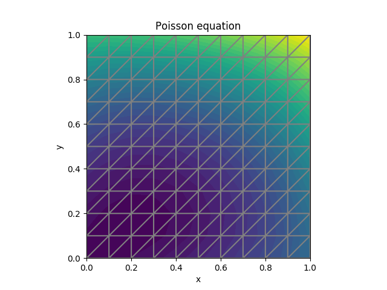

The toutorial was taken from Anders Logg's [Poisson tutorial](https://github.com/hplgit/fenics-tutorial/blob/master/pub/python/vol1/ft01_poisson.py)  
The strong form of the equation is  
$\nabla u = -10 $

The final solution is  

